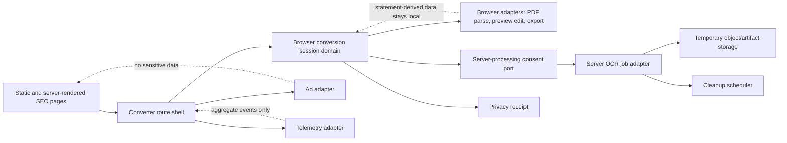
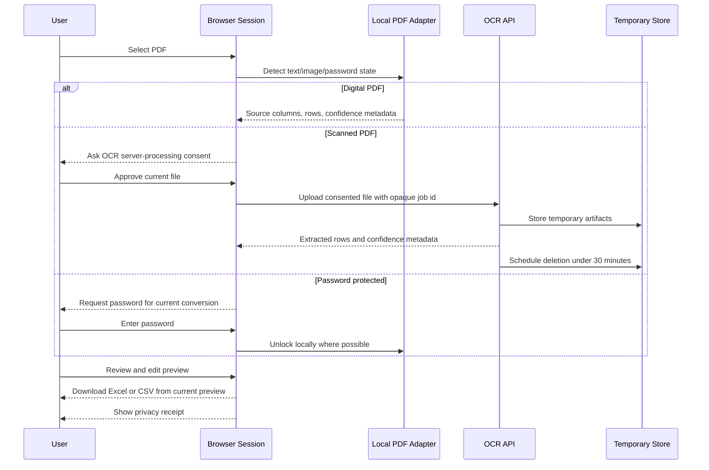

# Architecture Spine - pdf-converter

## Design Paradigm

Client-first hexagonal architecture inside a Next.js App Router application.

The browser converter session is the primary domain runtime for statement-derived data. Next.js owns crawlable pages, route shells, API route handlers, and deployment wiring. Domain ports define PDF intake, extraction, OCR consent, preview editing, export generation, telemetry, ads, and privacy receipt behavior. Adapters implement browser PDF parsing, server OCR jobs, file/object storage, Excel/CSV writing, analytics, and ad placement without owning the domain model.



## Invariants & Rules

### AD-1 - Client-First Hexagonal App [ADOPTED]

- **Binds:** all v1 implementation units.
- **Prevents:** a pure SPA weakening SEO, or a backend-first system making server upload the default for sensitive PDFs.
- **Rule:** Build as a Next.js App Router + TypeScript application where the conversion domain depends only on ports. UI, browser PDF parsing, OCR backend, storage, telemetry, ads, and export libraries are adapters.

### AD-2 - Browser Session Owns Statement-Derived Data [ADOPTED]

- **Binds:** upload, unlock, extraction, preview edits, export, privacy receipt.
- **Prevents:** duplicated server/client row state, accidental retention, and exports generated from stale extraction output.
- **Rule:** After file intake, the browser conversion session is the source of truth for extracted rows, source-derived columns, edits, confidence metadata, and receipt inputs. Server OCR may return extraction results for an approved job, but it must not become the durable owner of preview state.

### AD-3 - Processing Mode Routes the Trust Boundary [ADOPTED]

- **Binds:** FR-5, FR-6, FR-7, FR-8, FR-13, TEST-2.
- **Prevents:** silent upload of PDFs or passwords and ambiguous privacy messaging.
- **Rule:** Detect Digital PDF, Scanned PDF, and password-protected states before irreversible processing. Digital PDFs attempt local extraction first. Scanned/image PDFs require explicit OCR Server Processing consent before upload. Passwords remain local unless the user approves server processing for the current file.

### AD-4 - Server OCR Is a Temporary Job Boundary [ADOPTED]

- **Binds:** OCR processing, temporary files, generated server artifacts, cleanup, privacy receipt, observability.
- **Prevents:** long-lived document storage, undeletable processing artifacts, and false deletion claims.
- **Rule:** Server OCR receives only consented files through an opaque job id, stores inputs and artifacts in temporary storage, schedules deletion under 30 minutes, and exposes cleanup state to the receipt path. Receipt copy must distinguish completed, pending, failed, and not-applicable cleanup.

### AD-5 - Ads and Analytics Cannot See Sensitive Data [ADOPTED]

- **Binds:** FR-3, privacy guardrails, SEO pages, success metrics, counter-metrics.
- **Prevents:** advertising or analytics adapters observing statement files, passwords, extracted rows, edited preview data, account numbers, balances, names, or transaction descriptions.
- **Rule:** Ads live only in public/content shells outside upload, password, consent, preview, and download controls. Telemetry events may include aggregate mode, latency, success/failure class, and confidence bands, but never raw file contents, extracted text, preview cells, passwords, or statement-derived identifiers.

### AD-6 - Exports Come From the Reviewed Preview [ADOPTED]

- **Binds:** FR-9, FR-10, FR-11, FR-12, TEST-3.
- **Prevents:** losing user edits and forcing every statement into one global bank-transaction schema.
- **Rule:** Excel and CSV writers consume the current preview model. Preview/export columns are source-derived per conversion, with internal metadata for confidence and mapping kept separate from user-facing source columns.

### AD-7 - SEO Pages Share One Converter Entry [ADOPTED]

- **Binds:** SEO-1, SEO-2, SEO-3, SEO-4, SEO-5.
- **Prevents:** JavaScript-only acquisition content, doorway pages, and duplicated conversion logic across landing pages.
- **Rule:** Public SEO pages are statically generated or server-rendered with distinct useful copy and canonical metadata. Each page routes into the shared converter shell rather than implementing its own uploader or conversion workflow.

### AD-8 - Provider Choices Stay Behind Ports

- **Binds:** hosting, OCR engine, object storage, cleanup scheduler, monitoring.
- **Prevents:** early vendor lock-in before implementation planning while still preserving privacy and deletion invariants.
- **Rule:** Define ports for OCR jobs, temporary artifact storage, cleanup scheduling, and telemetry. Implementations may choose a provider later, but every adapter must satisfy AD-3, AD-4, and AD-5.

### AD-9 - Intake and Resource Safeguards Are Mandatory [ADOPTED]

- **Binds:** FR-4, security NFR, capacity and abuse protection, TEST-4.
- **Prevents:** interpreting "no artificial user-facing limits" as unlimited CPU, memory, upload size, OCR cost, or malformed-PDF exposure.
- **Rule:** Every intake path must validate type, size, structure, processing time, and failure class before expensive work. Server OCR endpoints must add rate limiting, abuse throttles, timeouts, bounded artifact size, and safe parser/OCR isolation without exposing internal errors.

## Consistency Conventions

| Concern | Convention |
| --- | --- |
| Naming | Use domain nouns from the PRD: `FinancialStatement`, `ProcessingMode`, `ConversionSession`, `ConversionPreview`, `PreviewColumn`, `PreviewRow`, `ConfidenceIndicator`, `PrivacyReceipt`, `ExportOutput`, `OcrJob`. |
| Data & formats | Use opaque ids for server jobs. Use ISO 8601 UTC timestamps. Keep source-derived statement columns as user-facing labels. Keep confidence/mapping metadata separate from exported columns unless the user explicitly chooses diagnostic output later. |
| State mutation | Mutate preview state only through conversion-session commands: intake, unlock, detect mode, extract, apply edit, add row, delete row, map column, undo, export, receipt. |
| Errors | Return user-safe error codes/classes to UI; log internal details only in structured server logs with request/job ids and no statement contents. |
| Telemetry | Emit aggregate events only: mode, consent accepted/cancelled, success/failure class, latency buckets, page type, OCR confidence bands. |
| Config/secrets | Keep secrets in environment variables. Public copy must not claim behavior that config or adapters do not enforce. |
| Accessibility | Upload, consent, preview editing, and download controls must be keyboard-accessible and designed for WCAG 2.2 AA on launch-critical paths. |

## Stack

| Name | Version |
| --- | --- |
| TypeScript | 6.0.3 |
| Next.js | 16.2.9 |
| React | 19.2.7 |
| pdfjs-dist | 6.1.200 |

## Structural Seed

```text
{root}/
  app/
    (public)/                 # SEO and trust/help pages
    converter/                # shared converter shell
    api/ocr-jobs/             # consented OCR job endpoints
  src/
    domain/conversion/        # conversion session model, commands, ports
    adapters/browser-pdf/     # digital PDF parsing/unlock/detection
    adapters/ocr-server/      # OCR job client/server adapter boundary
    adapters/export/          # Excel/CSV writers from preview model
    adapters/telemetry/       # no-sensitive-data events
    adapters/ads/             # public-shell ad placement only
    components/converter/     # upload, consent, preview, receipt UI
    content/seo/              # distinct landing/help page content
  tests/
    fixtures/statements/      # safe synthetic launch corpus
    e2e/                      # journey and trust-flow tests
```



## Capability -> Architecture Map

| Capability / Area | Lives in | Governed by |
| --- | --- | --- |
| FR-1 privacy-first upload promise | `app/converter`, `src/components/converter`, content copy | AD-3, AD-4, AD-5 |
| FR-2 sample statement demo | `app/converter`, `tests/fixtures/statements` | AD-2, AD-6 |
| FR-3 ads outside sensitive moments | `src/adapters/ads`, public route shells | AD-5 |
| FR-4 supported PDF intake | `src/domain/conversion`, `src/adapters/browser-pdf` | AD-2, AD-3 |
| FR-5 digital vs scanned detection | `src/adapters/browser-pdf`, conversion session | AD-3 |
| FR-6 password-protected PDFs | browser PDF adapter and consent flow | AD-3 |
| FR-7 processing mode display | converter UI and conversion session | AD-3 |
| FR-8 OCR consent | converter UI, OCR job port | AD-3, AD-4 |
| FR-9 preview rows | conversion session and preview components | AD-2, AD-6 |
| FR-10 lightweight edits | conversion session commands | AD-2, AD-6 |
| FR-11 low-confidence OCR | OCR adapter metadata, preview UI | AD-4, AD-6 |
| FR-12 Excel/CSV download | export adapter | AD-6 |
| FR-13 privacy receipt | conversion session, OCR job cleanup state | AD-3, AD-4 |
| SEO-1 through SEO-5 | `app/(public)`, `src/content/seo` | AD-7 |
| TEST-1 through TEST-4 | `tests/fixtures/statements`, e2e tests | AD-2, AD-3, AD-4, AD-6, AD-9 |

## Deferred

| Decision | Why Deferred |
| --- | --- |
| Hosting provider | The spine only needs provider-independent privacy, cleanup, and SEO invariants; implementation planning can choose Vercel, Cloudflare, AWS, or another provider. |
| OCR engine and pipeline | Tesseract.js 7.0.0 is current but does not directly support PDFs, and OCR quality/cost needs evaluation against the launch corpus. Keep OCR behind a port until tested. |
| Object storage and scheduler | Must satisfy temporary storage and under-30-minute deletion, but provider choice belongs with deployment planning. |
| Detailed table extraction heuristics | Statement layouts vary; heuristics should evolve from the launch corpus and tests while preserving AD-6. |
| Exact SEO copy and legal/privacy wording | PRD requires review; architecture binds data flow and enforcement points, not final legal text. |
